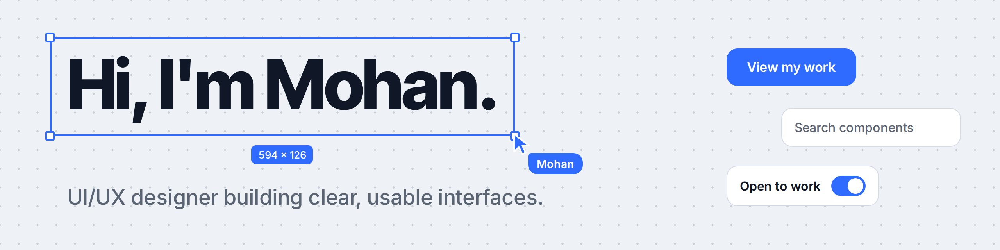

  

  
  
  

<h3 align="center">✨ Clear, useful design for products people actually enjoy using ✨</h3>

  <a href="https://my-portfolio-sable-eight-37.vercel.app/"><b>🌐 Portfolio</b></a>
  &nbsp;&nbsp;|&nbsp;&nbsp;
  <a href="https://www.linkedin.com/in/mohanmdesigner"><b>💼 LinkedIn</b></a>
  &nbsp;&nbsp;|&nbsp;&nbsp;
  <a href="https://instagram.com/designs_of_mohan"><b>📸 Instagram</b></a>

---

## 👋 About me

I'm **Mohan**, a UI/UX designer from Chennai and an Electronics & Communication Engineering student. 🎓

Engineering taught me to think in systems. Design lets me turn that logic into interfaces that feel obvious to use. I work with **healthcare 🏥, SaaS 💻, hospitality 🏨, and startups 🚀**, and every project starts with one question: *what is this person trying to do?*

> 💬 "The best interfaces are the ones you never have to think about."

---

## 🎯 What I do

| | Focus | What that looks like |
| :-: | :--- | :--- |
| 🔍 | **UX design** | Research, information architecture, user flows, wireframes, and prototypes |
| 🎨 | **UI design** | Visual design, design systems, Figma tokens, and responsive layouts |
| 📈 | **Landing pages & dashboards** | Conversion-focused pages and SaaS interfaces |
| 🧩 | **Front-end basics** | HTML, CSS, and JavaScript for smooth developer hand-off |
| 🤖 | **AI-assisted workflow** | Faster moodboards, copy tests, and prototypes, without skipping user research |

---

## 🖼️ Selected work

Six independent projects, each with a full case study on my [**portfolio**](https://my-portfolio-sable-eight-37.vercel.app/#work). 👈

| | Project | What it is |
| :-: | :--- | :--- |
| 🦷 | **SmileCare Dental Clinic** | Accessibility-first clinic website with clear pricing and a 3-step booking flow |
| 🏨 | **LuxeStay Hotel** | Luxury hotel experience with suite discovery, galleries, and a sticky reservation bar |
| ✅ | **TaskFlow** | Productivity dashboard with Kanban boards, sprint analytics, and dark mode |
| 📚 | **EduSpark** | Learning portal with student pathways, gamified milestones, and progress tracking |
| 🤖 | **Aether AI** | Conversion-focused startup landing page built around the AIDA framework |
| 🌐 | **Mohan M Portfolio** | Editorial-style portfolio with micro-interactions and instant contact options |

---

## 🛠️ Toolkit

  
  
  
  
  
   
  
  
  
  
  

---

## 🧭 How I design

- 🧑‍🤝‍🧑 **Human first:** psychology, Jakob's Law, and Don Norman's principles of feedback and affordance guide my decisions.
- ♿ **Accessible by default:** WCAG guidelines are part of the first wireframe.
- 🔁 **Test and refine:** I prototype early, listen to users, and improve.

---

## 💼 Experience

| | Role | Where |
| :-: | :--- | :--- |
| 🎨 | **Independent UI/UX Designer** | Freelance and self-directed client work |
| 🧑‍💻 | **Technology Intern** | Tech Josh |
| 📘 | **Technology Intern & Professional Course** | Skill Dragon |
| 🛠️ | **Technology Intern** | Cronic Techs |
| 🎓 | **B.E. Electronics & Communication Engineering** | MPNMJ Engineering College (ongoing) |

---

## 🌱 Right now

- 💼 Taking on freelance UI/UX projects for clinics, hotels, SaaS teams, and startups
- 🧠 Exploring how AI tools can speed up design without losing accessibility and research
- 📖 Studying design systems and front-end development

🎧 <b>A little more about me</b>

 

- 🎵 I design to lo-fi and indie-pop playlists
- 📱 I take apps apart on Product Hunt to see why they work
- 🌏 I enjoy exploring the Tamil Nadu tech scene
- 📸 I share my design work on Instagram at [@designs_of_mohan](https://instagram.com/designs_of_mohan)

---

## 🤝 Let's work together

I'm open to **freelance projects, design roles, internships, and collaborations**. If you have an idea, I'd love to hear it. 💡

  
  
  

⭐ Thanks for stopping by. Crafted with clean code and empathy.

